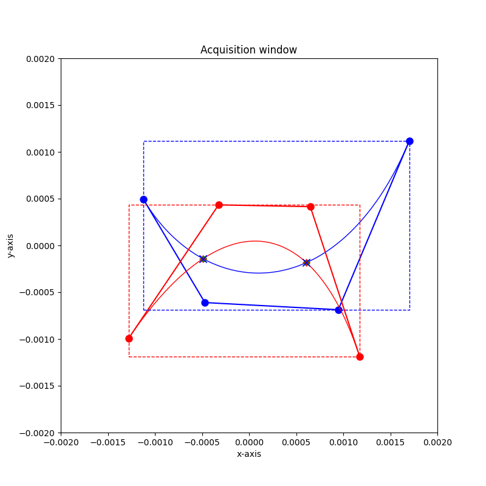
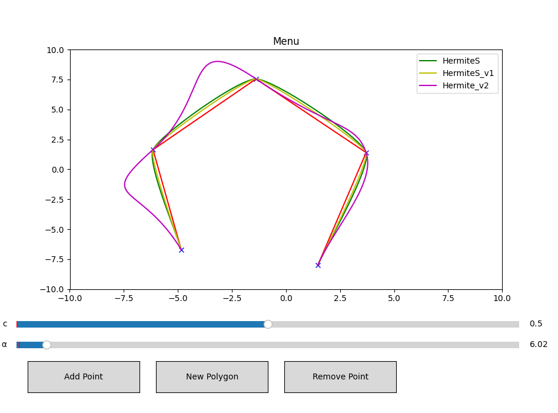
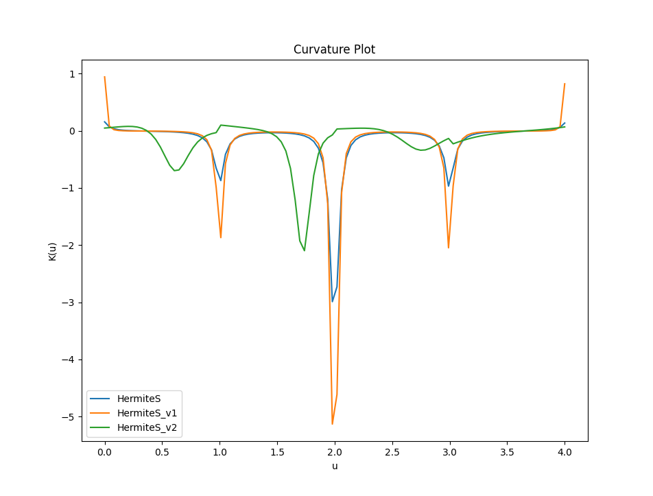
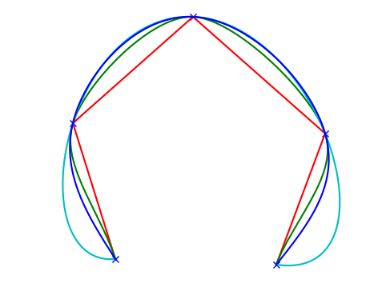
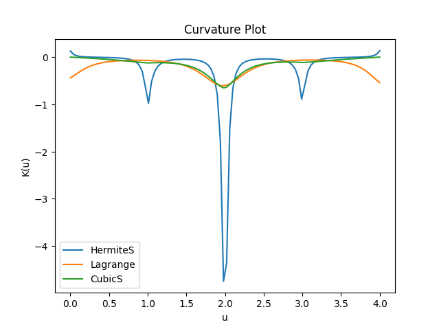

# Ensimag (2024/2025) : Geometric-Modeling Labs

## Description

This repository contains graphical modeling labs completed during my second year at Grenoble INP - Ensimag (equivalent to the first year of an MSc) in the field of **Mathematical Modeling, Vision, Graphics, and Simulation**. Most labs involve Python scripts for implementation and analysis.

## Installation

1. Clone this repository to your local machine:

    ```bash
    git clone https://github.com/BelfaidaMedReda/Geometric-Modeling.git
    ```

2. (Optional but recommended) Create a virtual environment:

    ```bash
    python -m venv venv
    ```

3. Activate the virtual environment:

    - In Windows :
      ```bash
      venv\Scripts\activate
      ```

    - In macOS/Linux :
      ```bash
      source venv/bin/activate
      ```

4. Install the required dependencies:

    ```bash
    pip install -r requirements.txt
    ```

## First Lab : Bezier Curves intersection detector

Developed a Python script **Intersection.py** to analyze and visualize intersections between multiple Bézier curves. The script employs Newton's method to precisely locate the intersection points.

### Demo of the code :

<div style="text-align: center;">
  
</div>

## Second Lab : Around Interpolation Methods

Developping Python scripts to discover different interpolation methods :

- Hermite Spline Interpolation with different methods of tangents estimation
- Lagrange Interpolation 
- Cubic Spline Curve

Analyzing key differences and characterics of each interpolation, and then comparing between them based on curvature plot.


### Functionnalities 

1. A dedicated script, **`estimation.py`**, provides a collection of functions to estimate tangents using different methods. These functions are essential for implementing Hermite spline interpolation and cubic spline curves.
Below is an overview of the key methods included :

#### Functions in `estimation.py`: 

- **`cardinal_splines`** : Estimates tangents using the cardinal spline approach with a configurable tension parameter `c`. 
- **`cardinal_splines_v1`** : Computes tangents based on a parameter `alpha`, ensuring flexibility while preventing division by zero
- **`cardinal_splines_v2`** : Offers a specific variant for tangent estimation, optimized for certain edge cases.  
- **`derive_cubique`** : Computes derivatives for cubic spline interpolation using a tridiagonal matrix approach to solve for the tangents. 
 
These methods are designed to handle a variety of scenarios, including boundary conditions and special cases, making them versatile tools for spline-based interpolation tasks.

2. A dedicated script, **curvature.py**, calculates and visualizes the curvature across different interpolation methods. It interacts with **comparaison.py** as a subprocess to generate and display plots using a Matplotlib GUI interface::

- Hermite Spline (3 versions)
- Lagrange Interpolation
- Cubic Spline

through :

- Curvature calculation for multiple interpolation techniques
- Graphical visualization of curvature variations
- Interactive script with cross-script communication

#### Functions in `curvature.py`:

- **K(u, Poly, option)** : Curvature calculation
- **LagrangeCurvature(u, Poly)**: Lagrange interpolation curvature
- **draw_curvature(Polygon)**: Graphical visualization


### Project Description

In this project, a user-friendly Matplotlib GUI is set up to receive control points. Depending on the chosen interpolation method, you can use the corresponding methods in the Index object to call the appropriate functions for interpolation and plot the curves.

The available functions for plotting the curves are as follows:

- **PlotHermiteSpline**
This function plots a Hermite spline curve using the classic Hermite spline interpolation method. It takes the control points and estimated tangents as input and generates a smooth curve that passes through these points.

- **PlotHermiteSpline_v1**
This variant of the PlotHermiteSpline function plots the Hermite spline curve using a different tangent estimation method. It’s useful for comparing the effect of different tangent estimations on the resulting interpolated curve.

- **PlotHermiteSpline_v2**
Another variant of the PlotHermiteSpline function that uses a different approach for tangent calculation. This version allows you to explore even more variations in the behavior of the Hermite spline based on the tangent estimation method used.

- **PlotLagrangeCurve**
This function plots a Lagrange interpolation curve. It uses the control points to generate a polynomial curve that exactly passes through all the points. This method is especially useful for cases where an exact fit through all points is needed, without requiring a smooth approximation.

- **PlotSplineCubique**
This function plots a cubic spline curve. It uses cubic spline interpolation, which ensures that the resulting curve is piecewise cubic and smooth, with continuous first and second derivatives at the points of control.

### Demo of the code 

#### Hermite Splines with all versions and their corresponding plots :

<div align="center">
  
</div>

<div align="center">
  
</div>


#### Lagrange, Spline Hermite and Spline Cubique C2 :

<div align="center">
  
</div>

<div align="center">
  
</div>
